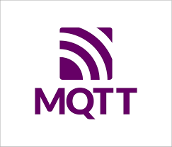
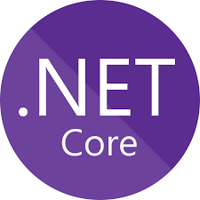
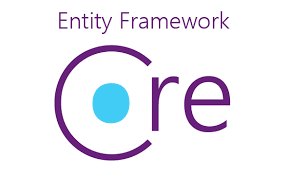
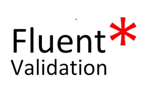

### 
 <h2>👋 Hello, I'm Umut </h2>

### <h3 align="center"> 💻 Full-Stack Developer | Software Development 💚 <h3/>

- 👀 I'm interested in Backend and Frontend technologies, software engineering.
- 🌱 I'm currently learning about Backend and Frontend development.
- 💞️ I'm open to collaborating on innovative software engineering projects.
- 📫 How to reach me: umutsahinkaya1@gmail.com

 « »
 « »

 

### 🛠️ Technologies & Tools

  
  
  
  
  
  
  
  

### 🚀 Advanced Microservices Patterns
- **Event Sourcing:** Recording all changes to application state as a sequence of events.
- **Distributed Transactions:** Managing transactions across multiple microservices.
- **Service Mesh Architecture:** Implementing communication control between microservices.
- **API Gateway:** Centralized entry point for managing and securing APIs.

### 🏢 DDD-focused Clean Architecture Implementation
- **Domain-Driven Design (DDD):** Modeling the software based on the business domain.
- **Clean Architecture:** Separating concerns and dependencies in a maintainable structure.
- **Entities, Value Objects, Aggregates:** Building rich domain models with proper encapsulation.

### 📚 SOLID and Clean Code Techniques
- **SOLID Principles:** Embracing Single Responsibility, Open/Closed, Liskov Substitution, Interface Segregation, and Dependency Inversion principles.
- **Clean Code Practices:** Writing code that is easy to understand, maintain, and extend.

### 🔄 Ultra-Advanced Synchronous and Asynchronous Repository Implementation
- **Asynchronous Repository:** Implementing repositories that support asynchronous operations.
- **Dynamic Search Implementation:** Building dynamic search functionality for flexible querying.

### 🔄 Advanced Mapping and AutoMapper Implementation
- **Response-Request Pattern Mapping:** Implementing mappings between DTOs and domain entities.
- **Automapper:** Simplifying object-to-object mapping.

### 🌐 Advanced Entity Framework Implementation
- **Best Practice-oriented Entity Framework:** Applying best practices for efficient data access.
- **API Implementation:** Developing RESTful APIs with proper routing and versioning.

### ⚙️ Extension Writing Techniques
- **Extension Methods:** Utilizing extension methods for enhanced functionality.
- **Multiple and Related Domain Modeling:** Implementing models that represent complex relationships.

### 🌟 Advanced Mapping Implementation
- **Advanced Mapping Techniques:** Utilizing advanced mapping strategies for complex scenarios.
- **Migration Implementation:** Managing database schema changes through migrations.

### 📏 Business Rule and Clean Code Writing Techniques
- **Clean Code Techniques:** Following clean code principles for readability and maintainability.
- **Business Rule Implementation:** Ensuring business rules are effectively implemented.

### 🚨 Global Error Handling
- **Global Error Management:** Handling errors consistently across the application.
- **Pipeline Writing Techniques:** Structuring code using pipeline patterns for modularization.

### 🔒 Security and JWT Implementation
- **Security Best Practices:** Implementing secure coding practices.
- **JWT Implementation:** Securing and managing user authentication using JSON Web Tokens.

### 📧 Mailing Implementation
- **Mailing Services:** Integrating mailing services for notifications.
- **Test-Driven Infrastructure Development:** Writing tests to ensure code reliability and functionality.

### 🧪 Test-Focused Infrastructure Development
- **Moq Implementation:** Employing Moq for effective unit testing.
